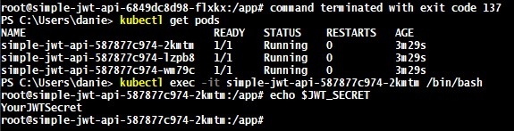

### Dependencies

* [Deploy guide completed](deploy.md)


### The problem

The `JWT_SECRET` variable that you created in the [Step #3 from the deployment guide](https://github.com/jungleBadger/FSND-Deploy-Flask-App-to-Kubernetes-Using-EKS/blob/master/troubleshooting/deploy.md#step-3---create-jwt-secret-variable) is not
 automatically available to your Pods nor Python app.
 
This value is in fact [loaded during the `buildspec` execution](https://github.com/jungleBadger/FSND-Deploy-Flask-App-to-Kubernetes-Using-EKS/blob/2bff3c7387f04773fd591e1d0193ef4ac6b92f74/buildspec.yml#L37), so the Codepipeline context does have 
awareness of this secret value and can do things with it. 

Our goal here is to make this environment available from within Pods, so the Python app can read and use those values.


### Adding the env setup to the `simple-jwt-api.yml`
Here we simply need to add a [new environment variable declaration](https://kubernetes.io/docs/concepts/configuration/secret/#using-secrets-as-environment-variables) to our Deployment pod specification.

```yaml
apiVersion: apps/v1
kind: Deployment
metadata:
  name: simple-jwt-api
spec:
  replicas: 3
  strategy:
    type: RollingUpdate
    rollingUpdate:
      maxUnavailable: 2
      maxSurge: 2
  selector:
    matchLabels:
      app: simple-jwt-api
  template:
    metadata:
      labels:
        app: simple-jwt-api
    spec:
      containers:
        - name: simple-jwt-api
          image: CONTAINER_IMAGE
          securityContext:
            privileged: false
            readOnlyRootFilesystem: false
            allowPrivilegeEscalation: false
          env:
          - name: JWT_SECRET
            value: JWT_SECRET_VALUE
          ports:
            - containerPort: 8080
```

I attached the whole Deployment spec to avoid confusions, but here is the portion that really make this happen:

```yaml
env:
- name: JWT_SECRET
value: JWT_SECRET_VALUE
```

### Dynamically loading the secret through buildspec.yml

What we actually want to do here is to replace the `JWT_SECRET_VALUE` that we declared above with the value
 we loaded from AWS SSM
 
During [`pre-build` phase](https://github.com/jungleBadger/FSND-Deploy-Flask-App-to-Kubernetes-Using-EKS/blob/2bff3c7387f04773fd591e1d0193ef4ac6b92f74/buildspec.yml#L11) add the following snippet

```yaml
 - sed -i 's@JWT_SECRET_VALUE@'"$JWT_SECRET"'@' simple-jwt-api.yml
```

This will replace [this key](https://github.com/jungleBadger/FSND-Deploy-Flask-App-to-Kubernetes-Using-EKS/blob/2bff3c7387f04773fd591e1d0193ef4ac6b92f74/simple-jwt-api.yml#L41) 
with actually resolves from [this load](https://github.com/jungleBadger/FSND-Deploy-Flask-App-to-Kubernetes-Using-EKS/blob/2bff3c7387f04773fd591e1d0193ef4ac6b92f74/buildspec.yml#L39)


### Testing
You can simply list your pods, attach a shell and validate if the secret is loaded in there.

```shell script
kubectl get pods
kubectl exec -it <POD_ID> /bin/bash
echo $JWT_SECRET
```




### Notes

There are some advanced approaches like using Helm and Kubernetes secrets rather than environment variables,
 we are focusing on a quick and somewhat reliable way of loading & using this specific value on this specific context.
 
 Here a list of good resources to plan a more robust solution if needed:
 
 * [K8s secrets documentation](https://kubernetes.io/docs/concepts/configuration/secret/)
 * [AWS SSM & K8s secrets integration](https://github.com/godaddy/kubernetes-external-secrets)
 * [Another AWS SSM & K8s secrets integration](https://github.com/cmattoon/aws-ssm)
